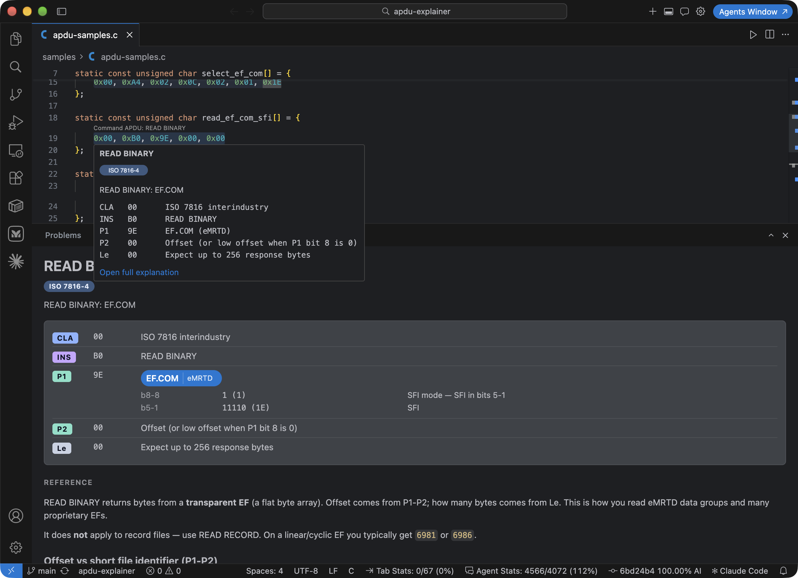

# APDU Explainer

Local VS Code / Cursor extension that detects hex APDUs in the editor and explains them. No marketplace install, no VSIX, no network — copy the extension folder into your editor’s extensions directory.



CodeLens names the command (or the status-word meaning). Hover shows a compact decode. The bottom **APDU Explainer** panel has this APDU split into fields, then a **Reference** page for the command.

## Find the extensions folder

Do not assume `~/.vscode`. Cursor, VS Code Insiders, VSCodium, portable builds, and remote servers all use different paths. Some machines have no `~/.vscode` at all.

**Use the editor to open the folder it actually uses:**

1. Open VS Code or Cursor.
2. Command Palette: `Ctrl+Shift+P` (Windows/Linux) or `Cmd+Shift+P` (macOS).
3. Run **Extensions: Open Extensions Folder**.

That opens this editor’s extensions directory. Copy into *that* folder.

If the command is missing, typical locations are:

| Editor | Extensions folder |
| --- | --- |
| VS Code | `~/.vscode/extensions` (Windows: `%USERPROFILE%\.vscode\extensions`) |
| VS Code Insiders | `~/.vscode-insiders/extensions` |
| VSCodium / Code - OSS | `~/.vscode-oss/extensions` |
| Cursor | `~/.cursor/extensions` (Windows: `%USERPROFILE%\.cursor\extensions`) |
| Portable VS Code | `data/extensions` next to the app (macOS: `code-portable-data/extensions`) |
| Remote SSH / WSL | `~/.vscode-server/extensions` (Insiders: `~/.vscode-server-insiders/extensions`) |

If the editor was started with `--extensions-dir`, that path wins. The Command Palette command still shows the live folder.

## Install

Copy the **`anki.apdu-explainer-0.0.1`** folder (not the whole repo) into the extensions directory you opened above. Keep that folder name; VS Code requires `publisher.name-version`.

Example after **Extensions: Open Extensions Folder** already put you in the right place:

```bash
cp -R anki.apdu-explainer-0.0.1 /path/to/the/extensions/folder/
```

A symlink works too, if you want to keep developing from this repo:

```bash
ln -s /absolute/path/to/apdu-explainer/anki.apdu-explainer-0.0.1 /path/to/the/extensions/folder/anki.apdu-explainer-0.0.1
```

Then reload:

1. Command Palette → **Developer: Reload Window**.
2. Confirm **APDU Explainer** appears under Extensions (installed, not Marketplace).

Repeat the copy/symlink for each editor you use (for example both VS Code and Cursor).

## Use

Open a source or log file that contains hex. Try `samples/apdu-samples.txt` or `samples/apdu-samples.c`.

Three hex layouts are detected (spaces required; packed `00A4040C` is ignored):

- `00 A4 04 0C`
- `0x00 0xA4 0x04 0x0C`
- `0x00, 0xA4, 0x04, 0x0C`

A command may wrap across consecutive lines of the same layout (typically 16 bytes per row). Truncated or uneven dumps are left unmarked.

On a complete APDU you get:

1. A light highlight on the hex.
2. A CodeLens: `Command APDU: SELECT FILE` or `Response APDU: File not found` (status-word meaning, not `SW 6A82`).
3. A hover with spec pills and a compact CLA / INS / P1 / P2 / DATA table.

Open the bottom panel:

- Click the CodeLens, or
- Hover and follow **Open full explanation**, or
- Select the hex and run **Explain APDU** from the editor context menu (Command Palette has the same command).

The panel heading and pills are this APDU. The boxed table is the split (CLA, INS, P1, P2, DATA, …). **Reference** under the table is the teaching page for that command or status word (`catalog/about/*.md`).

CodeLens follows the editor settings:

- `editor.codeLens` — show or hide
- `editor.codeLensFontSize` — label size

Hex highlighting: `apduExplainer.enableDecorations`.

## Catalogs

Shipped decode data lives under `anki.apdu-explainer-0.0.1/catalog/` (commands, files, AIDs, tags, status words). Teaching markdown is `catalog/about/<command-id>.md` (status words: `sw-6a82.md`).

Custom overlay: add JSON in `catalog/custom/` (see `catalog/custom/demo.json`) and optional pages in `catalog/custom/about/`. Custom ids win over the shipped catalogs. Reload the window after adding files.
